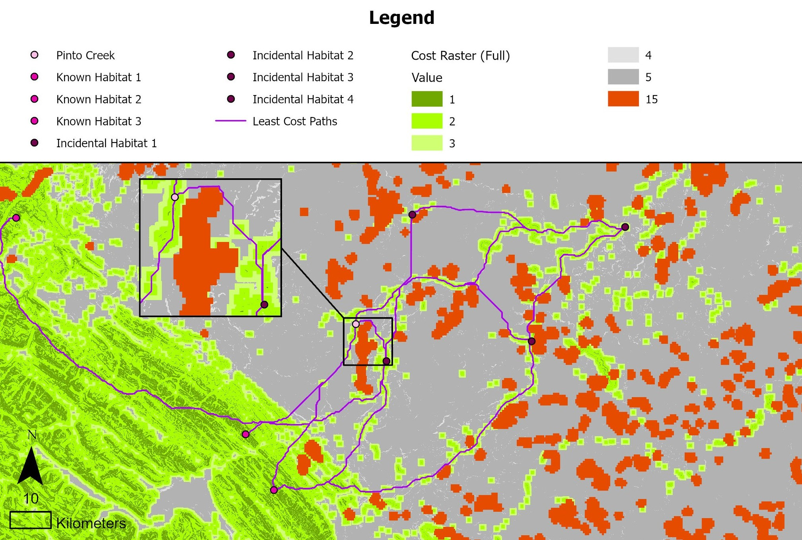
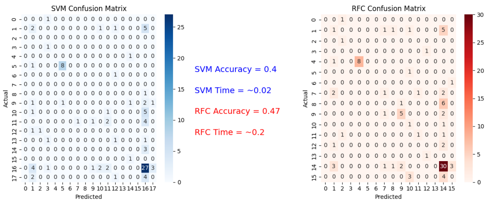
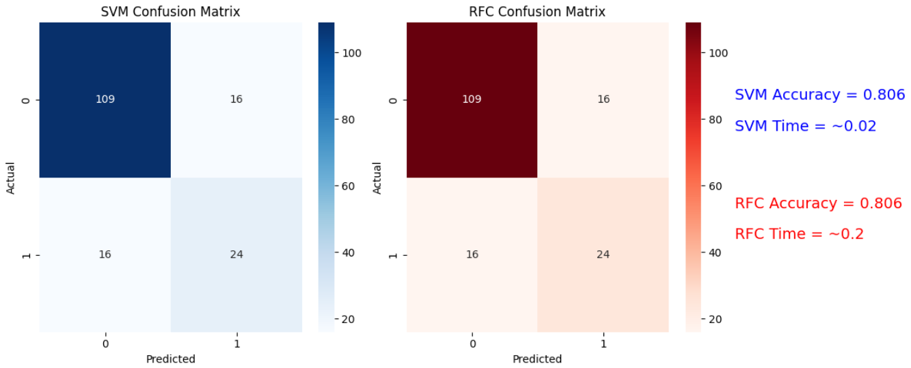

# Capstone: Pinto Creek Mountain Goats

## Project Description

Alberta’s Pinto Creek Canyon is the home to the only canyon-dwelling mountain goats (*Oreamnos Americanus*) in the province (Hinton Wood Products (HWP), 2014). Since 1999, this herd has a population between 25 and 49 individuals, although exact numbers are hard to determine due to the sensitivity of these creatures to human disturbance (HWP, 2014; Côte, 2016). Pinto Creek Canyon is protected as a designated Natural Area, and Hinton Wood Products Ltd. has worked with environmental consultants in protecting the habitat of this herd by adding an additional Special Management Area buffer in the 1-km radius surrounding the Natural Area designation (HWP, 2014). Even with these protections in place, there are concerns about the long-term survival of this mountain goat herd.

Given this herd’s small population size, it is important that there are pathways to connect with other nearby mountain goat herds for genetic diversity and to avoid concerning levels of interbreeding (HWP, 2014). However, with rapidly increasing human landscape-altering activities in the area – such as logging, oil well digging, etc. – it is possible for the routes between herds to be cut off, isolating the canyon-dwelling herd entirely. Landscape disturbance not only creates physical barriers through buildings and environmental excavation, but previous research shows that the noise generated from said activity could cause the mountain goats to avoid the area by up to 1 kilometer (White & Gregovich, 2016).

The future of this herd depends on maintaining access to neighbouring mountain goat population. However, it is unknown by exactly which pathways the Pinto Creek mountain goats have been connecting with neighbouring herds. This study will find the most likely movement routes of the Pinto Creek mountain goat herd and how these routes are impacted by landscape disturbance using least-cost pathway analysis.

## Map

Initial results show that key access pathways are cut off by landscape disturbance in 2022, and many access pathways are modified to require goats to travel a longer distance between habitat areas.



# **R Project: Comparison of Machine Learning Techniques in Classifying Trees in the Petawawa Research Forest**

## Project Description

Forest managers rely on accurate information about where conifer and deciduous trees occur because the two groups differ in growth, wood properties, wildlife value, and carbon storage. Their distinct spectral signatures in remote‑sensing imagery make them good candidates for machine‑learning classification, and the Petawawa Research Forest provides an ideal mixed‑stand test area with strong reference data. However, many studies use a single classification model without evaluating alternatives, leaving uncertainty about whether the chosen method is actually the most effective. By comparing Random Forest and Support Vector Machines using the same predictors, metrics, and dataset, this project identifies which model provides better accuracy and computational efficiency for distinguishing conifer and deciduous trees in Petawawa.

## Code Snippets

::: {.panel-tabset group="language"}
## Classification Preparation

``` (.r)
# List of tree species paired with their tree type ("C" = Coniferous, "D" = Deciduous)
trees_code = [
    ("American beech ", "D"), ("American elm ", "D"), ("Balsam fir ", "C"),
    ("Basswood ", "D"), ("Black ash ", "D"), ("Eastern hemlock ", "C"),
    ("Ironwood ", "D"), ("Jack pine ", "C"), ("Largetooth aspen ", "D"),
    ("Northern white cedar ", "C"), ("Norway Spruce ", "C"),
    ("Red (soft) maple ", "D"), ("Red oak ", "D"), ("Red pine ", "C"),
    ("Sugar Maple ", "D"), ("Tamarack ", "C"), ("Trembling Aspen ", "D"),
    ("White birch ", "D"), ("White pine ", "C"), ("White spruce ", "C"),
    ("Yellow birch ", "D"),
]

trees_code = pd.DataFrame(trees_code, columns=['species', 'tree_code'])
df = plots_df.merge(trees_code, how='inner', on='species')

# Merge tree code into plot geodata
plots_all = plots_xy.merge(df[['plot_id', 'species', 'tree_code']],
                           on="plot_id", how="left")

plots_all = plots_all.dropna(subset=["tree_code"])

# Extracting ALS metrics
src = rasterio.open(als_metrics)

# Match CRS
plots_all = plots_all.to_crs(src.crs)

coords = [(geom.x, geom.y) for geom in plots_all.geometry]
als_values = list(src.sample(coords))
als_array = np.array(als_values)

als_cols = [f"metric_{i}" for i in range(als_array.shape[1])]
als_df = pd.DataFrame(als_array, columns=als_cols)

# Combine ALS + attributes
df_model = pd.concat([plots_all.reset_index(drop=True),
                      als_df.reset_index(drop=True)], axis=1)

# CREATE BINARY CLASS (0=Conifer, 1=Deciduous)
df_model["tree_type"] = df_model["tree_code"].map({"C": 0, "D": 1})

# Remove missing ALS
df_model = df_model.dropna(subset=als_cols + ["tree_type"])

# Prepare datasets
X = df_model[als_cols].values    #independent variable
y = df_model["tree_type"].values #dependent variable

# Spliting
X_train, X_test, y_train, y_test = train_test_split(
    X, y, test_size=0.3, random_state=42, stratify=y)
```

## Random Forest Classifier

``` (.python)
# Start timer
start_time = time.time()

# Fit and train model
rf = RandomForestClassifier()
rf.fit(X_train, y_train)

# Predictions
y_pred = rf.predict(X_test)
accuracy = accuracy_score(y_test, y_pred)

# Confusion matrix and classification report
print("Accuracy:", accuracy)
rf_conf = confusion_matrix(y_test, y_pred)
print("\nConfusion Matrix:\n", rf_conf)
print("\nClassification Report:\n",
      classification_report(y_test, y_pred, zero_division=0))

# How long program ran
print("--- %s seconds ---" % (time.time() - start_time))
```

## Support Vector Machines

``` (.python)
# Start timer
start_time = time.time()

# Scale for SVM
scaler = StandardScaler()
X_train_scaled = scaler.fit_transform(X_train)
X_test_scaled = scaler.transform(X_test)

# Train SVM model
svm = SVC(kernel='rbf', C=10, gamma='scale')
svm.fit(X_train_scaled, y_train)

# Predict
y_pred = svm.predict(X_test_scaled)

svm_conf = confusion_matrix(y_test, y_pred)

# Results
print("Accuracy:", round(accuracy_score(y_test, y_pred), 3))
print("\nConfusion Matrix:\n", confusion_matrix(y_test, y_pred))
print("\nClassification Report:\n",
      classification_report(y_test, y_pred,
                            target_names=["Conifer", "Deciduous"]))

# How long program ran
print("--- %s seconds ---" % (time.time() - start_time))
```
:::

## Results

While accuracy was found to be comparable between the two classification models, Support Vector Machines produced results much faster – taking a tenth of the time of Random Forest Classifier.





## **References**

Côte, S. (1996). Mountain goat responses to helicopter disturbance. *Wildlife Society Bulletin*, *24*(4), 681–685. CABI Databases.

Hinton Wood Products. (2014). *Pinto Creek Mountain Goats Habitat Conservation Strategy*. https://www1.agric.gov.ab.ca/\$department/deptdocs.nsf/all/formain15770/\$FILE/pinto-creek-goats-scs.pdf

White, K. S., & Gregovich, D. P. (2016). *Mountain Goat Resource Selection in Relation to  Mining-related Disturbance, near the Kensington  Mine, Southeast Alaska* (No. ADF&G/DWC/WRR–2016–2; Wildlife Research Report). Alaska Department of Fish and Game - Division of Wildlife Conservation. www.adfg.alaska.gov/static/home/library/pdfs/wildlife/research_pdfs/wrr_2016_2_mountain_goat_resource_selection_mining_disturbance_kensington_southeast.pdf
